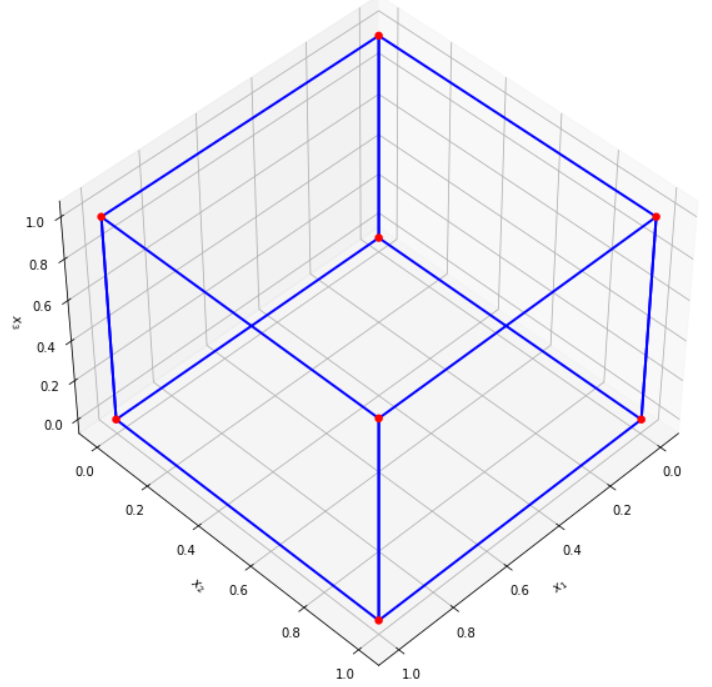

# Basic example

In this tutorial we solve a bunch of simple DoE-problems and while doing so we explore the functions provided by this package.


We start with the problem of finding a D-optimal design for fitting a linear model with three continuous decision variables

$$
x_1, x_2, x_3 \in [0,1],
$$

eight experiments and no additional constraints. The figure below shows a D-optimal design for this problem.



Now let's try to find this design with doe. First, we have to define the problem in opti

```python
import opti

problem = opti.Problem(
    inputs=[
        opti.Continuous("x1", [0,1]),
        opti.Continuous("x2", [0,1]),
        opti.Continuous("x3", [0,1]),
    ],
    outputs=[
        opti.Continuous("y")
    ],
)
```

The output $y$ is added for technical reasons, because every <code>opti.Problem</code> requires at least one output. But it will not play
any role for the functionality of doe. Now we hand over the problem to doe's <code>find_local_max_ipopt()</code> function and see the results.

```python
import doe
import matplotlib.pyplot as plt

res = doe.find_local_max_ipopt(
    problem=problem,
    model_type="linear",
    n_experiments=8,
)
```


Nice, our method could reproduce the d-optimal design. Note that there are different ways to specify the model we refer to, namely as a string or as a <code>Formula</code> object. In our example we could write the model_type parameter as

```python
from formulaic import Formula

model_type = Formula("x1 + x2 + x3")
```

or just 

```python
model_type = "x1 + x2 + x3"
```

Also note that <code> n_experiments </code> is an optional paramter. If no value is given, <code>find_local_max_ipopt()</code> will automatically find a number of experiments that fits to the problem and model.

Now let's go one step further and add constraints to the problem. We decide to add one mixture constraint and three additional linear inequality constraints. 

* $x_1 + x_2 + x_3 = 1$
* $x_2 \geq 0.1$
* $x_3 \leq 0.6$
* $5 x_1 + 4 x_2 \leq 3.9$
* $20 x_1 - 5 x_2 \geq 3$

Then the problem reads 

```python
problem = opti.Problem(
   inputs = opti.Parameters([opti.Continuous(f"x{i+1}", [0, 1]) for i in range(3)]),
   outputs = [opti.Continuous("y")],
   constraints = [
       opti.LinearEquality(names=["x1","x2","x3"], rhs=1),
       opti.LinearInequality(["x2"], lhs=[-1], rhs=-0.1),
       opti.LinearInequality(["x3"], lhs=[1], rhs=0.6),
       opti.LinearInequality(["x1","x2"], lhs=[5,4], rhs=3.9),
       opti.LinearInequality(["x1","x2"], lhs=[-20,5], rhs=-3)
   ]
)

res = find_local_max_ipopt(problem, "linear")
```

As expected for linear models, <code>find_local_max_ipopt</code> finds the corner points of the feasible set


# JacobianForLogdet

Internally, <code>find_local_max_ipopt</code> uses gradient based optimization methods from <code>cyipopt</code>. For larger models and multiple decision variables, the dimensionality of the problem quickly rises and gradient evaluation with finite differences takes a lot of time. Therefore, doe uses an analytic formulation for gradients of the objective and the constraints. However, for models with terms of higher than 3rd order, one part of the gradient has to be provided by the user (for a more detailed explanation, see the documentation of <code>JacobianForLogdet</code>). 

The gradient of the objective function $\log(\det(I + \delta \mathbb{I}))$ (where $I$ is the information matrix and $\delta$ is a regularization parameter) is implemented as the class <code>JacobianForLogdet</code>. To create an instance one has to pass the opti problem, the model and the number of experiments, e.g.

```python
model = doe.get_formula_from_string(problem=problem, model_type="linear")
J = doe.JacobianForLogdet(problem=problem, model=model, n_experiments=2)
```

The jacobian at one point can then be evaluated using the method <code>jacobian</code>.

```python
x = np.array([1,0,0,0,1,0])

model = doe.get_formula_from_string(problem=problem, model_type="linear")
J.jacobian(x)

>>> array([-1.33333322,  0.66666658,  0.        ,  0.66666658, -1.33333322, 0.        ])
```

For models with terms of higher order than three, the user has to provide a function with signature <code>jacobian_building_block(x: np.ndarray) -> nd.ndarray</code>. It should take a decision variable vector as input and return a the matrix $\Big(\frac{\partial y_i}{\partial x_j}\Big)_{ij}$ where $(y_i)_i$ are the model terms and $(x_j)_j$ the decision variables. You can pass this function as an optional parameter when creating a <code>JacobianForLogdet</code> object. Internally, this is what <code>find_local_max_ipopt</code> does when you pass a function as the optional parameter <code>jacobian_building_block</code>.